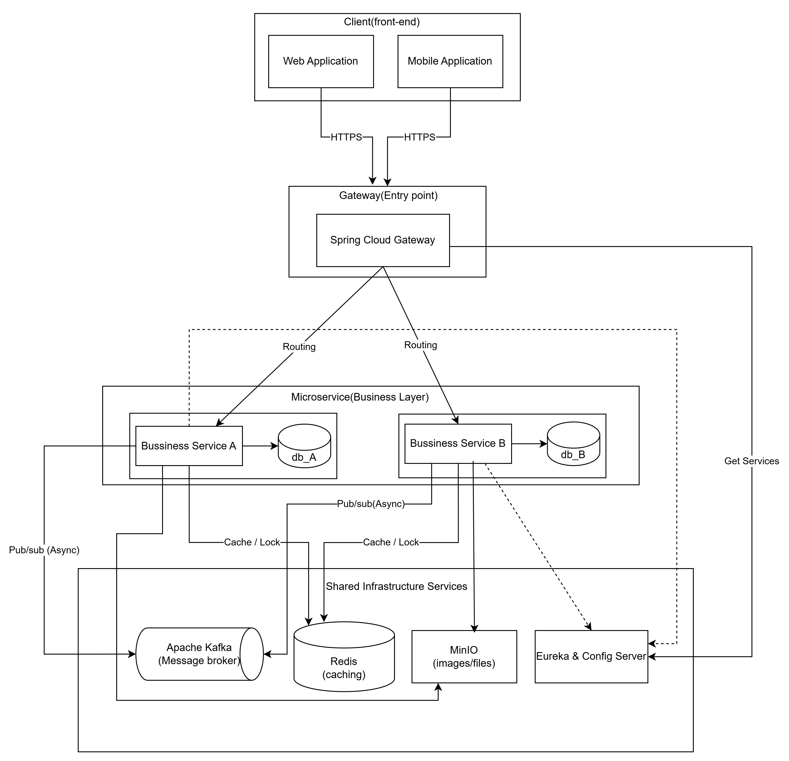

# Pharmacy Microservice

A cloud-native backend system built with **Spring Boot** and **Spring Cloud** using the **Microservices Architecture** pattern. The system is designed for an online pharmacy platform, providing high scalability, fault isolation, maintainability, and asynchronous communication between services.

---

## Table of Contents

* [Introduction](#introduction)
* [Overall Deployment Architecture](#overall-deployment-architecture)
* [Service Structure](#service-structure)
* [System Architecture](#system-architecture)
* [Technologies Used](#technologies-used)
* [Installation Guide](#installation-guide)
* [API Documentation](#api-documentation)
* [Security](#security)
* [Monitoring & Logging](#monitoring--logging)
* [Contributing](#contributing)
* [License](#license)
* [Contact](#contact)
* [Roadmap](#roadmap)

---

## Introduction

Pharmacy Backend Microservice is a distributed backend application developed using the **Microservices Architecture** pattern. Each business capability is implemented as an independent service with its own database, allowing services to be developed, deployed, and scaled independently.

The platform adopts modern cloud-native technologies including **Spring Boot**, **Spring Cloud**, **Apache Kafka**, **Redis**, **MinIO**, and **MySQL** to provide centralized configuration management, asynchronous messaging, distributed caching, and object storage.

---

## Overall Deployment Architecture


---

## Service Structure

### Infrastructure Service

Provides infrastructure components shared across all microservices.

| Property         | Value                              |
| ---------------- | ---------------------------------- |
| **Port**         | `8888`                             |
| **Database**     | None                               |
| **Technologies** | Spring Cloud Config, Eureka Server |

---

### API Gateway

Acts as the single entry point for all client requests.

| Property         | Value                                                                  |
| ---------------- | ---------------------------------------------------------------------- |
| **Port**         | `8080`                                                                 |
| **Database**     | None                                                                   |
| **Technologies** | Spring Cloud Gateway, Spring Security Reactive, OAuth2 Resource Server |

---

### Identity Service

Responsible for authentication and authorization.

| Property         | Value                           |
| ---------------- | ------------------------------- |
| **Port**         | Random                          |
| **Database**     | MySQL                           |
| **Technologies** | Spring Security, JWT, OpenFeign |

---

### Product Service

Manages products, categories, inventory, and search functionality.

| Property         | Value                          |
| ---------------- | ------------------------------ |
| **Port**         | Random                         |
| **Database**     | MySQL                          |
| **Technologies** | Redis, Hibernate Search, MinIO |

---

### Order Service

Handles order creation and business workflows.

| Property         | Value                            |
| ---------------- | -------------------------------- |
| **Port**         | Random                           |
| **Database**     | MySQL                            |
| **Technologies** | Kafka Producer, Redis, OpenFeign |

---

### Notification Service

Processes system notifications.

| Property         | Value                           |
| ---------------- | ------------------------------- |
| **Port**         | Random                          |
| **Database**     | MySQL                           |
| **Technologies** | Kafka Consumer, JavaMail Sender |

---

### Other Services

Includes additional business services following the standard layered architecture.

| Property     | Value                                                                   |
| ------------ | ----------------------------------------------------------------------- |
| **Port**     | Random                                                                  |
| **Database** | MySQL                                                                   |
| **Services** | User Service, Cart Service, Payment Service, File Service, Blog Service |

#### Common Characteristics

* Layered Architecture (Controller → Service → Repository)
* RESTful API Design
* Spring Data JPA & Hibernate
* Jakarta Bean Validation
* Global Exception Handling
* OpenFeign for synchronous communication
* Kafka for asynchronous communication

---

## System Architecture

### Architectural Patterns

### Microservices Architecture

* Independent deployment
* Database per Service
* Loose coupling
* Independent scalability

### Event-Driven Architecture

* Apache Kafka
* Asynchronous messaging
* Event-based communication

### API Gateway Pattern

* Single entry point
* Authentication & Authorization
* Request routing
* Load balancing

### Cache-Aside Pattern

* Redis caching
* Reduced database load
* Improved response time

### Service Discovery

* Eureka Server
* Automatic service registration
* Dynamic service discovery

### Centralized Configuration

* Spring Cloud Config
* Environment-specific configuration
* Externalized configuration management

---

## Technologies Used

### Backend Framework

| Technology           | Purpose                        |
| -------------------- | ------------------------------ |
| Spring Boot 3.x      | Backend Framework              |
| Spring Cloud         | Microservice Infrastructure    |
| Spring Security      | Authentication & Authorization |
| Spring Data JPA      | Data Persistence               |
| Spring Cloud Gateway | API Gateway                    |
| Spring WebFlux       | Reactive Programming           |
| OpenFeign            | Service Communication          |
| Hibernate Search     | Full-text Search               |
| Spring Kafka         | Event Streaming                |

### Database & Storage

| Technology | Purpose             |
| ---------- | ------------------- |
| MySQL 8    | Relational Database |
| Redis      | Distributed Cache   |
| MinIO      | Object Storage      |

### Messaging

| Technology   | Purpose                  |
| ------------ | ------------------------ |
| Apache Kafka | Event Streaming Platform |
| Kafka UI     | Kafka Management         |

### Development Tools

| Technology      | Purpose               |
| --------------- | --------------------- |
| Maven           | Build Tool            |
| Docker          | Containerization      |
| Docker Compose  | Local Infrastructure  |
| MapStruct       | Object Mapping        |
| Lombok          | Boilerplate Reduction |
| JWT             | Authentication        |
| JavaMail Sender | Email Notifications   |

---

## Installation Guide

### Prerequisites

* Java 17+
* Maven 3.8+
* Docker & Docker Compose
* Git

### Clone Repository

```bash
git clone https://github.com/your-username/pharmacy-backend-microservice.git
cd pharmacy-backend-microservice
```

### Start Infrastructure

```bash
docker compose up -d

docker compose ps
```

### Build Shared Module

```bash
cd common
mvn clean install
cd ..
```

### Start Services

Run each microservice in a separate terminal.

```bash
cd infra-service
mvn spring-boot:run

cd ../api-gateway
mvn spring-boot:run

cd ../identity-service
mvn spring-boot:run

cd ../product-service
mvn spring-boot:run

cd ../order-service
mvn spring-boot:run

cd ../notification-service
mvn spring-boot:run
```

### Environment Variables

```properties
CONFIG_SERVER_URI=http://localhost:8888

SPRING_DATASOURCE_URL=jdbc:mysql://localhost:3307/{database}

SPRING_DATASOURCE_USERNAME=root
SPRING_DATASOURCE_PASSWORD=1234

SPRING_REDIS_HOST=localhost
SPRING_REDIS_PORT=6379

SPRING_KAFKA_BOOTSTRAP_SERVERS=localhost:29092

MINIO_ENDPOINT=http://localhost:9000
MINIO_ACCESS_KEY=minioadmin
MINIO_SECRET_KEY=minioadmin
```

### Service Endpoints

| Service       | URL                   |
| ------------- | --------------------- |
| API Gateway   | http://localhost:8080 |
| Config Server | http://localhost:8888 |
| Kafka UI      | http://localhost:9090 |
| MinIO Console | http://localhost:9001 |
| Redis         | localhost:6379        |
| MySQL         | localhost:3307        |

---

## API Documentation

| Service             | URL                                                                                |
| ------------------- | ---------------------------------------------------------------------------------- |
| API Gateway         | http://localhost:8080/swagger-ui.html                                              |
| Individual Services | [http://localhost:{port}/swagger-ui.html](http://localhost:{port}/swagger-ui.html) |

---

## Security

* JWT Authentication
* OAuth2 Resource Server
* Role-Based Access Control (RBAC)
* BCrypt Password Encryption
* Refresh Token Support

---

## Monitoring & Logging

> Planned for future releases.

* Spring Boot Actuator
* Prometheus
* Grafana
* ELK Stack
* Zipkin / Jaeger

---

## Contributing

1. Fork the repository.
2. Create a feature branch.

```bash
git checkout -b feature/new-feature
```

3. Commit your changes.

```bash
git commit -m "Add new feature"
```

4. Push your branch.

```bash
git push origin feature/new-feature
```

5. Open a Pull Request.

---

## License

This project is licensed under the **MIT License**.

---

## Contact

**Email:** [tuantt3010@gmail.com](mailto:tuantt3010@gmail.com)

---

## Roadmap

* [ ] Circuit Breaker (Resilience4j)
* [ ] Distributed Tracing
* [ ] API Rate Limiting
* [ ] GraphQL Support
* [ ] WebSocket Notifications
* [ ] Monitoring Dashboard
* [ ] Automated Backup Strategy
* [ ] Multi-language Support
* [ ] Elasticsearch Integration
* [ ] Mobile Backend API
