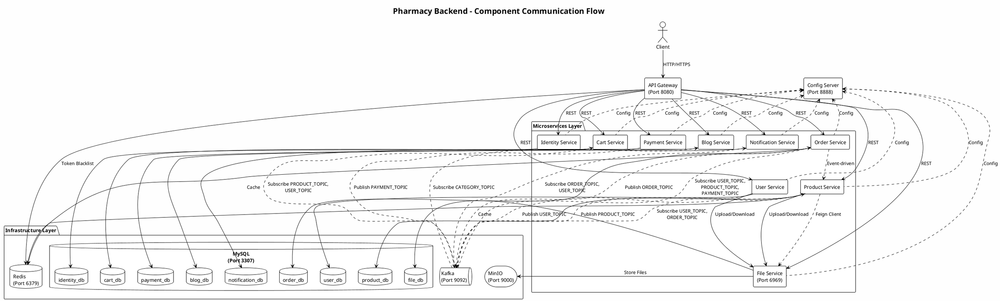
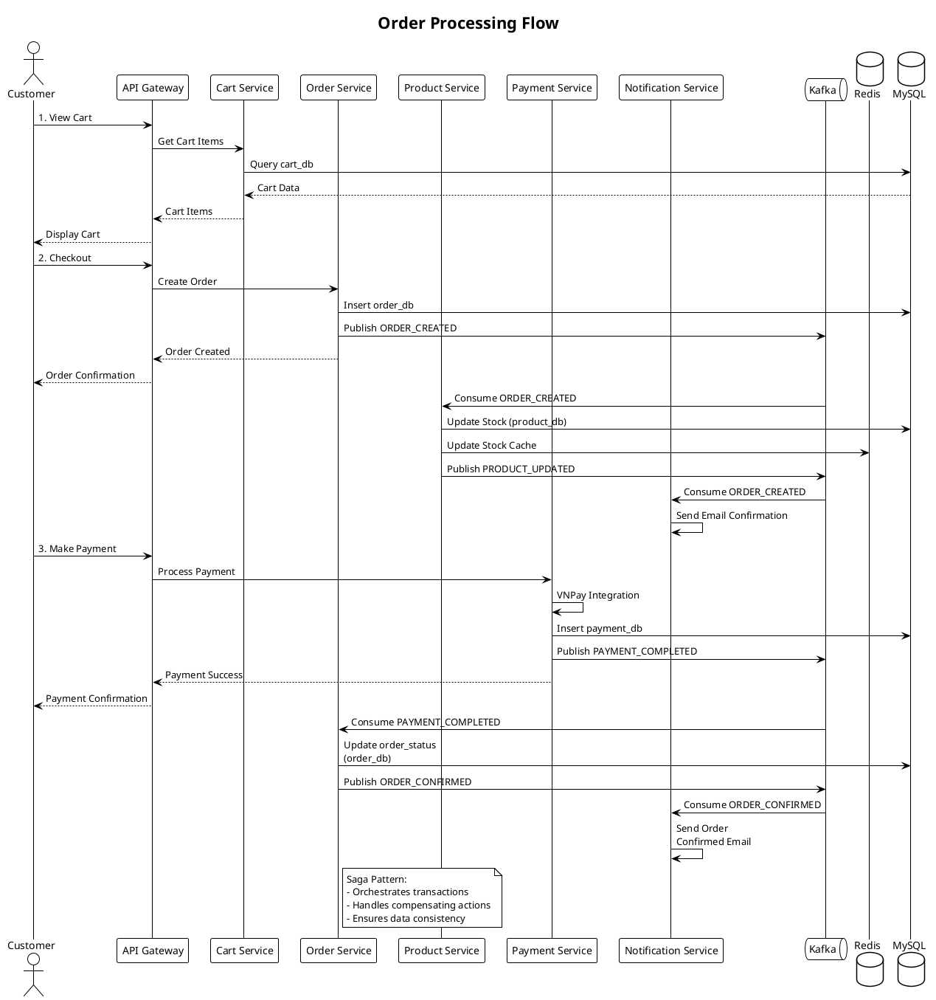
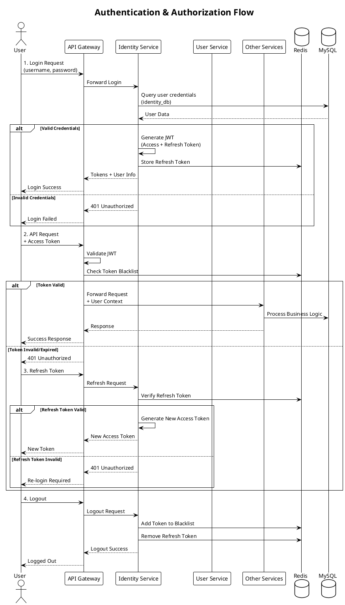
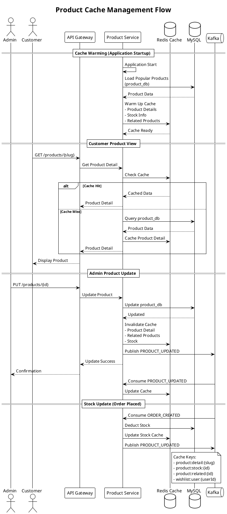
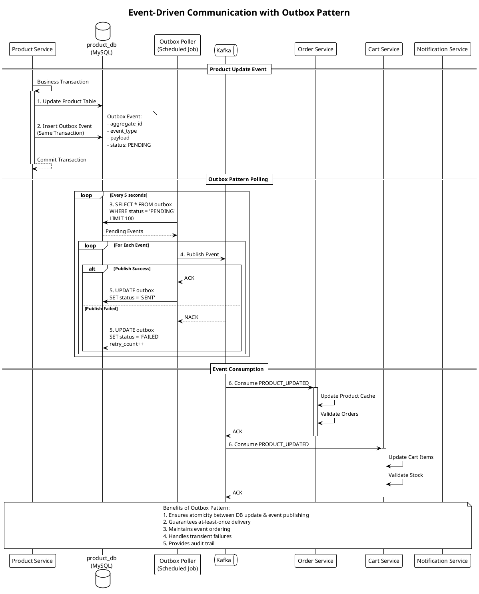

# Pharmacy Backend Microservice

## 📋 Mục lục
- [Giới thiệu](#giới-thiệu)
- [Mô hình triển khai tổng thể](#mô-hình-triển-khai-tổng-thể)
- [Cấu trúc các Service](#cấu-trúc-các-service)
- [Luồng giao tiếp giữa các thành phần](#luồng-giao-tiếp-giữa-các-thành-phần)
- [Kiến trúc hệ thống](#kiến-trúc-hệ-thống)
- [Công nghệ sử dụng](#công-nghệ-sử-dụng)
- [Hướng dẫn cài đặt](#hướng-dẫn-cài-đặt)

---

## 🌟 Giới thiệu

Pharmacy Backend Microservice là một hệ thống backend được xây dựng theo kiến trúc microservices dành cho ứng dụng quản lý nhà thuốc trực tuyến. Hệ thống được thiết kế để đáp ứng các yêu cầu về tính mở rộng, độ tin cậy và hiệu suất cao.

---

## 🏗️ Mô hình triển khai tổng thể

### Kiến trúc Microservices

Hệ thống được chia thành các service độc lập, mỗi service đảm nhiệm một chức năng nghiệp vụ cụ thể:

```
┌─────────────────────────────────────────────────────────────────┐
│                         CLIENT LAYER                            │
│                    (Web/Mobile Applications)                    │
└────────────────────────────┬────────────────────────────────────┘
                             │
┌────────────────────────────▼────────────────────────────────────┐
│                       API GATEWAY                               │
│              (Spring Cloud Gateway - Port 8080)                 │
│         ┌────────────────────────────────────────┐              │
│         │  - Routing                             │              │
│         │  - Authentication/Authorization        │              │
│         │  - Rate Limiting                       │              │
│         │  - Load Balancing                      │              │
│         └────────────────────────────────────────┘              │
└─────┬──────────┬─────────┬──────────┬──────────┬───────────────┘
      │          │         │          │          │
┌─────▼──┐  ┌───▼────┐ ┌──▼─────┐ ┌─▼────┐  ┌──▼─────────┐
│Identity│  │Product │ │ Order  │ │ User │  │  Payment   │
│Service │  │Service │ │Service │ │Service  │  Service   │
└────────┘  └────────┘ └────────┘ └──────┘  └────────────┘
      │          │         │          │          │
┌─────▼──┐  ┌───▼────┐ ┌──▼─────┐ ┌─▼────┐  ┌──▼─────────┐
│  Cart  │  │  Blog  │ │  File  │ │Notifi│  │   Config   │
│Service │  │Service │ │Service │ │cation│  │   Server   │
└────────┘  └────────┘ └────────┘ └──────┘  └────────────┘
      │          │         │          │          │
┌─────┴──────────┴─────────┴──────────┴──────────┴─────────────┐
│                   INFRASTRUCTURE LAYER                        │
│  ┌─────────┐  ┌────────┐  ┌───────┐  ┌──────┐  ┌─────────┐  │
│  │  MySQL  │  │ Redis  │  │ Kafka │  │MinIO │  │Common   │  │
│  │Database │  │ Cache  │  │ Queue │  │Storage  │ Module  │  │
│  └─────────┘  └────────┘  └───────┘  └──────┘  └─────────┘  │
└───────────────────────────────────────────────────────────────┘
```

### Mô hình Deployment với Docker

```yaml
# Docker Compose Architecture
┌──────────────────────────────────────────────────────────────┐
│                    Docker Network: backend                   │
│                                                              │
│  ┌─────────────┐  ┌──────────────┐  ┌───────────────┐      │
│  │   MySQL     │  │    Redis     │  │    Kafka      │      │
│  │   Port:3307 │  │   Port:6379  │  │   Port:9092   │      │
│  └─────────────┘  └──────────────┘  └───────────────┘      │
│                                                              │
│  ┌─────────────┐  ┌──────────────┐  ┌───────────────┐      │
│  │   MinIO     │  │  Kafka UI    │  │               │      │
│  │ Port:9000/1 │  │  Port:9090   │  │               │      │
│  └─────────────┘  └──────────────┘  └───────────────┘      │
│                                                              │
│  ┌───────────────────────────────────────────────────┐      │
│  │          Microservices (Spring Boot)              │      │
│  │  - API Gateway (8080)                             │      │
│  │  - Config Server (8888)                           │      │
│  │  - Identity Service                               │      │
│  │  - Product Service                                │      │
│  │  - Order Service                                  │      │
│  │  - User Service                                   │      │
│  │  - Cart Service                                   │      │
│  │  - Payment Service                                │      │
│  │  - Blog Service                                   │      │
│  │  - File Service                                   │      │
│  │  - Notification Service                           │      │
│  └───────────────────────────────────────────────────┘      │
└──────────────────────────────────────────────────────────────┘
```

---

## 🔧 Cấu trúc các Service

### 1. **Config Server**
**Mô tả:** Quản lý cấu hình tập trung cho tất cả các microservices.
- **Port:** 8888
- **Chức năng:**
  - Lưu trữ cấu hình cho tất cả services
  - Hỗ trợ hot reload cấu hình
  - Quản lý profiles (dev, uat, prod)

### 2. **API Gateway**
**Mô tả:** Điểm vào duy nhất cho tất cả các request từ client.
- **Port:** 8080
- **Công nghệ:** Spring Cloud Gateway (WebFlux)
- **Chức năng:**
  - Routing requests đến các services tương ứng
  - Authentication & Authorization
  - Rate limiting
  - Load balancing
  - Request/Response logging
  - CORS handling

### 3. **Identity Service**
**Mô tả:** Quản lý xác thực và phân quyền người dùng.
- **Chức năng:**
  - Đăng ký, đăng nhập người dùng
  - Quản lý JWT tokens
  - Refresh token mechanism
  - Blacklist token (Redis)
  - OAuth2 integration
- **Database:** identity_db (MySQL)

### 4. **User Service**
**Mô tả:** Quản lý thông tin người dùng và hồ sơ cá nhân.
- **Chức năng:**
  - Quản lý thông tin người dùng
  - Profile management
  - Address management
  - User roles & permissions
- **Database:** user_db (MySQL)
- **Kafka:** Producer (USER_TOPIC)

### 5. **Product Service**
**Mô tả:** Quản lý sản phẩm, danh mục và thương hiệu.
- **Chức năng:**
  - CRUD operations cho products
  - Quản lý categories và brands
  - Product images management
  - Stock management
  - Promotion events (Quartz Scheduler)
  - Wishlist management
  - Cache warming (Redis)
  - Outbox pattern cho event publishing
- **Database:** product_db (MySQL)
- **Kafka:** 
  - Producer (PRODUCT_TOPIC)
  - Consumer (USER_TOPIC, ORDER_TOPIC)
- **Cache:** Redis (product details, stock, related products)
- **File Storage:** MinIO integration

### 6. **Order Service**
**Mô tả:** Xử lý đơn hàng và quản lý trạng thái đơn hàng.
- **Chức năng:**
  - Tạo và quản lý orders
  - Order status tracking
  - Order history
  - Revenue statistics
  - Order cancellation
  - Saga pattern implementation
- **Database:** order_db (MySQL)
- **Kafka:** 
  - Producer (ORDER_TOPIC)
  - Consumer (USER_TOPIC, PRODUCT_TOPIC, PROFILE_TOPIC, PAYMENT_TOPIC)

### 7. **Cart Service**
**Mô tả:** Quản lý giỏ hàng của người dùng.
- **Chức năng:**
  - Add/Remove/Update cart items
  - Cart persistence
  - Cart validation với product stock
- **Database:** cart_db (MySQL)
- **Kafka:** Consumer (PRODUCT_TOPIC, USER_TOPIC)

### 8. **Payment Service**
**Mô tả:** Xử lý thanh toán và tích hợp payment gateways.
- **Chức năng:**
  - Payment processing
  - VNPay integration
  - Payment verification
  - Transaction history
- **Database:** payment_db (MySQL)
- **Kafka:** Producer (PAYMENT_TOPIC)

### 9. **Blog Service**
**Mô tả:** Quản lý blog và bài viết.
- **Chức năng:**
  - CRUD operations cho blog posts
  - Blog categories management
  - Comments management
- **Database:** blog_db (MySQL)
- **Kafka:** Consumer (CATEGORY_TOPIC)

### 10. **File Service**
**Mô tả:** Quản lý file upload/download.
- **Port:** 6969
- **Chức năng:**
  - File upload/download
  - Image processing
  - File metadata management
- **Storage:** MinIO (Object Storage)
- **Database:** file_db (MySQL)

### 11. **Notification Service**
**Mô tả:** Gửi thông báo đến người dùng.
- **Chức năng:**
  - Email notifications
  - SMS notifications (future)
  - Push notifications (future)
  - Template management
- **Database:** notification_db (MySQL)
- **Kafka:** Consumer (ORDER_TOPIC, USER_TOPIC)

### 12. **Common Module**
**Mô tả:** Shared library chứa code dùng chung.
- **Chức năng:**
  - Common DTOs
  - Common exceptions
  - Security utilities
  - Kafka event models
  - Redis service
  - Base entities
  - Mappers interfaces
  - Enums

---

## 🔄 Luồng giao tiếp giữa các thành phần

### Sơ đồ tổng quan (PlantUML)



### Luồng xử lý đặt hàng (Order Flow)



### Luồng Authentication & Authorization



### Luồng Product Cache Management



### Luồng Event-Driven Communication (Outbox Pattern)



### Luồng File Upload & Management

```plantuml
@startuml
!theme plain
title File Upload & Management Flow

actor User
participant "API Gateway" as Gateway
participant "Product Service" as Product
participant "File Service" as File
storage "MinIO" as MinIO
database "file_db\n(MySQL)" as FileDB
database "product_db\n(MySQL)" as ProductDB

== Product Creation with Images ==
User -> Gateway: POST /products\n+ thumbnail\n+ images[]
Gateway -> Product: Create Product Request

activate Product
Product -> File: 1. Upload Thumbnail
activate File
File -> MinIO: Store File
MinIO --> File: File Path
File -> FileDB: Save Metadata
FileDB --> File: File Metadata
File --> Product: FileMetadataResponse\n(id, path, url)
deactivate File

loop For Each Image
    Product -> File: 2. Upload Image
    activate File
    File -> MinIO: Store File
    MinIO --> File: File Path
    File -> FileDB: Save Metadata
    File --> Product: FileMetadataResponse
    deactivate File
end

Product -> ProductDB: 3. Save Product\n+ thumbnail_uuid\n+ thumbnail_path
ProductDB --> Product: Product Created
Product --> Gateway: Product Response
Gateway --> User: Success
deactivate Product

== Product Image Update ==
User -> Gateway: PUT /products/{id}\n+ new images
Gateway -> Product: Update Product

activate Product
alt Has New Thumbnail
    Product -> File: Delete Old Thumbnail
    activate File
    File -> MinIO: Delete File
    File -> FileDB: Update Status
    File --> Product: Deleted
    deactivate File
    
    Product -> File: Upload New Thumbnail
    activate File
    File -> MinIO: Store File
    File -> FileDB: Save Metadata
    File --> Product: New Metadata
    deactivate File
end

Product -> ProductDB: Update Product Info
Product --> Gateway: Updated
Gateway --> User: Success
deactivate Product

== File Serving ==
User -> Gateway: GET /files/{uuid}
Gateway -> File: Get File
File -> FileDB: Query Metadata
FileDB --> File: File Info
File -> MinIO: Get File
MinIO --> File: File Data
File --> Gateway: File Stream
Gateway --> User: File Content

note right of MinIO
  MinIO Buckets:
  - pharmacy-product
  - pharmacy-category
  - pharmacy-blog
  - pharmacy-user
  
  File Categories:
  - PRODUCT
  - CATEGORY
  - BLOG
  - USER_AVATAR
end note

@enduml
```

---

## 🏛️ Kiến trúc hệ thống

### Patterns và Principles

1. **Microservices Architecture**
   - Service Independence
   - Database per Service
   - Decentralized Data Management

2. **Event-Driven Architecture**
   - Asynchronous Communication via Kafka
   - Event Sourcing
   - CQRS (Command Query Responsibility Segregation)

3. **Outbox Pattern**
   - Ensures atomicity between DB updates and event publishing
   - Transactional outbox table
   - Polling publisher

4. **Saga Pattern**
   - Distributed transaction management
   - Orchestration-based saga in Order Service
   - Compensating transactions

5. **API Gateway Pattern**
   - Single entry point
   - Centralized authentication
   - Request routing and composition

6. **Cache-Aside Pattern**
   - Redis caching for frequently accessed data
   - Cache invalidation strategies
   - Cache warming on startup

7. **Circuit Breaker Pattern** (Future)
   - Resilience4j integration planned
   - Fault tolerance
   - Fallback mechanisms

---

## 💻 Công nghệ sử dụng

### Backend Framework
- **Spring Boot 3.5.5** - Core framework
- **Spring Cloud Gateway** - API Gateway
- **Spring Cloud Config** - Configuration management
- **Spring Data JPA** - Data persistence
- **Spring Security** - Authentication & Authorization
- **Spring Kafka** - Event streaming
- **Spring WebFlux** - Reactive programming (Gateway)

### Database & Storage
- **MySQL 8.x** - Relational database
- **Redis** - Caching & Session management
- **MinIO** - Object storage for files

### Message Queue
- **Apache Kafka** - Event streaming platform
- **Kafka UI** - Kafka management interface

### Others
- **MapStruct** - Object mapping
- **Lombok** - Boilerplate code reduction
- **Quartz Scheduler** - Job scheduling
- **JWT** - Token-based authentication
- **Docker & Docker Compose** - Containerization
- **Maven** - Build tool

---

## 🚀 Hướng dẫn cài đặt

### Prerequisites

- **Java 17+**
- **Maven 3.8+**
- **Docker & Docker Compose**
- **Git**

### Clone Repository

```bash
git clone https://github.com/your-repo/pharmacy-backend-microservice.git
cd pharmacy-backend-microservice
```

### Setup Infrastructure với Docker Compose

```bash
# Start all infrastructure services
docker-compose up -d

# Verify services are running
docker-compose ps

# View logs
docker-compose logs -f
```

### Build Common Module

```bash
cd common
mvn clean install
cd ..
```

### Build và chạy các Microservices

#### Option 1: Run từng service riêng

```bash
# Config Server (chạy đầu tiên)
cd config-server
mvn spring-boot:run

# API Gateway
cd ../api-gateway
mvn spring-boot:run

# Other services
cd ../identity-service
mvn spring-boot:run

cd ../user-service
mvn spring-boot:run

cd ../product-service
mvn spring-boot:run

cd ../order-service
mvn spring-boot:run

cd ../cart-service
mvn spring-boot:run

cd ../payment-service
mvn spring-boot:run

cd ../blog-service
mvn spring-boot:run

cd ../file-service
mvn spring-boot:run

cd ../notification-service
mvn spring-boot:run
```

#### Option 2: Build tất cả

```bash
# Build all services
mvn clean install -DskipTests

# Run each service in separate terminal
```

### Cấu hình Environment Variables

Mỗi service cần cấu hình các biến môi trường:

```properties
# Config Server
CONFIG_SERVER_URI=http://localhost:8888
SPRING_PROFILES_ACTIVE=dev

# Database
SPRING_DATASOURCE_URL=jdbc:mysql://localhost:3307/[db_name]
SPRING_DATASOURCE_USERNAME=root
SPRING_DATASOURCE_PASSWORD=1234

# Redis
SPRING_REDIS_HOST=localhost
SPRING_REDIS_PORT=6379

# Kafka
SPRING_KAFKA_BOOTSTRAP_SERVERS=localhost:29092

# MinIO (File Service)
MINIO_ENDPOINT=http://localhost:9000
MINIO_ACCESS_KEY=minioadmin
MINIO_SECRET_KEY=minioadmin
```

### Truy cập các Services

| Service | URL | Description |
|---------|-----|-------------|
| API Gateway | http://localhost:8080 | Main entry point |
| Config Server | http://localhost:8888 | Configuration server |
| Kafka UI | http://localhost:9090 | Kafka management |
| MinIO Console | http://localhost:9001 | Object storage console |
| MySQL | localhost:3307 | Database |
| Redis | localhost:6379 | Cache server |

### Tạo Kafka Topics

```bash
# Exec into Kafka container
docker exec -it kafka bash

# Create topics
kafka-topics --create --topic USER_TOPIC --bootstrap-server localhost:9092 --partitions 3 --replication-factor 1
kafka-topics --create --topic PRODUCT_TOPIC --bootstrap-server localhost:9092 --partitions 3 --replication-factor 1
kafka-topics --create --topic ORDER_TOPIC --bootstrap-server localhost:9092 --partitions 3 --replication-factor 1
kafka-topics --create --topic PAYMENT_TOPIC --bootstrap-server localhost:9092 --partitions 3 --replication-factor 1
kafka-topics --create --topic CATEGORY_TOPIC --bootstrap-server localhost:9092 --partitions 3 --replication-factor 1

# List topics
kafka-topics --list --bootstrap-server localhost:9092
```

### Testing

```bash
# Run tests
mvn test

# Run tests for specific service
cd product-service
mvn test
```

---

## 📚 API Documentation

API documentation được tự động sinh ra bằng Swagger/OpenAPI cho mỗi service.

- **API Gateway Swagger UI**: http://localhost:8080/swagger-ui.html
- **Service Documentation**: http://localhost:{service-port}/swagger-ui.html

---

## 🔐 Security

- **Authentication**: JWT-based authentication
- **Authorization**: Role-based access control (RBAC)
- **Token Management**: Access token + Refresh token
- **Token Blacklist**: Redis-based token blacklist for logout
- **Password Encryption**: BCrypt

---

## 📊 Monitoring & Logging (Future)

- **Spring Boot Actuator** - Health checks and metrics
- **Prometheus** - Metrics collection
- **Grafana** - Metrics visualization
- **ELK Stack** - Centralized logging
- **Zipkin/Jaeger** - Distributed tracing

---

## 🤝 Contributing

1. Fork the repository
2. Create your feature branch (`git checkout -b feature/AmazingFeature`)
3. Commit your changes (`git commit -m 'Add some AmazingFeature'`)
4. Push to the branch (`git push origin feature/AmazingFeature`)
5. Open a Pull Request

---

## 📝 License

This project is licensed under the MIT License.

---

## 👥 Team

- **Backend Team** - TASC Intern Batch 9

---

## 📧 Contact

For any questions or support, please contact: [your-email@example.com]

---

## 🗺️ Roadmap

- [ ] Implement Circuit Breaker pattern
- [ ] Add distributed tracing (Zipkin/Jaeger)
- [ ] Implement API rate limiting per user
- [ ] Add GraphQL support
- [ ] Implement WebSocket for real-time notifications
- [ ] Add comprehensive monitoring dashboard
- [ ] Implement automated backup strategies
- [ ] Add multi-language support
- [ ] Implement advanced search with Elasticsearch
- [ ] Add mobile app backend support
